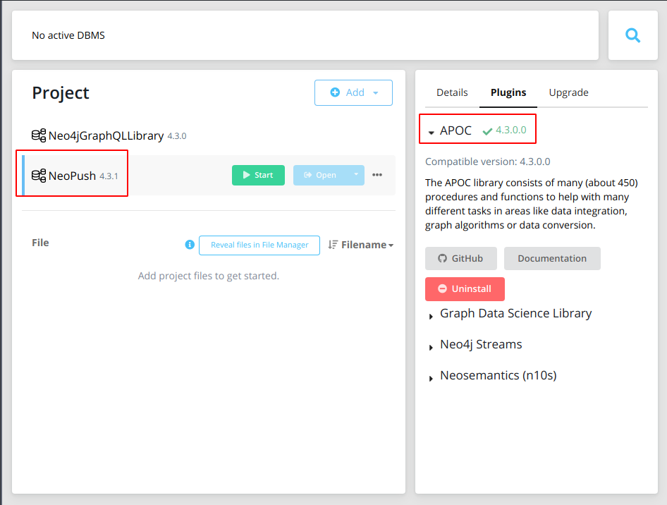

# NOTES

- [NOTES](#notes)
  - [TLDR Start Project](#tldr-start-project)
  - [Clone project](#clone-project)
  - [Convert NeoPush to a starter project](#convert-neopush-to-a-starter-project)
  - [Create database in Neo4 Desktop](#create-database-in-neo4-desktop)
    - [package.json](#packagejson)
    - [tsconfig.json](#tsconfigjson)
    - [tsconfig.json server](#tsconfigjson-server)
    - [Eslit](#eslit)
  - [Bootstrap NeoPush TLDR](#bootstrap-neopush-tldr)
  - [Fix Apollo Server 3.0](#fix-apollo-server-30)
  - [Seed](#seed)
  - [Run Backend and Frontend](#run-backend-and-frontend)
  - [Fix Eslint](#fix-eslint)
  - [Change NeoPush project to Other name](#change-neopush-project-to-other-name)
  - [Add HTTPS and Self Signed Certificates](#add-https-and-self-signed-certificates)
  - [Fix : Internal Error: Assertion failed: Expected workspace to have been resolved](#fix--internal-error-assertion-failed-expected-workspace-to-have-been-resolved)
  - [Fix : Cannot apply hunk #14 (set enableInlineHunks for details)](#fix--cannot-apply-hunk-14-set-enableinlinehunks-for-details)
  - [Fix : Yarn YN0001: │ Error: While cloning ... ENOENT: no such file or directory, scandir](#fix--yarn-yn0001--error-while-cloning--enoent-no-such-file-or-directory-scandir)
  - [Change Repo Origin](#change-repo-origin)
  - [Cypher](#cypher)
    - [Indexs](#indexs)
  - [Next React](#next-react)
  - [Planning](#planning)

## TLDR Start Project

1. start neo4j desktop neopush database
2. yarn run neo4j-gqllib-starter
3. open [Apollo Explorer](http://localhost:5000/graphql)
1. launch operation on **explorer** or in **rest client** in `client.http`

```gql
mutation SignInMutation($email: String!, $password: String!) {
  signIn(email: $email, password: $password)
}

{
  "email": "admin@admin.com",
  "password": "password"
}
```

## Clone project

```shell
$ git clone https://github.com/neo4j/graphql.git
```

## Convert NeoPush to a starter project

first remove packages `graphql`, `ogm` and `package-tests`, this was the source code of neo4j lib

and move `examples/migration` and `examples/neo4j-push` projects to `packages` 

```shell
$ rm README.md packages/graphql/ packages/ogm/ packages/package-tests/ -R
$ mv examples/README.md .
$ mkdir -p packages/
$ mv examples/migration/ packages/
$ mv examples/neo-push/ packages/
$ mv packages/neo-push packages/neo4j-gqllib-starter
$ rm examples docs -R

$ tree  packages/ -L 1
packages/
├── migration
│   ├── package.json
│   ├── README.md
│   └── src
└── neo4j-gqllib-starter
    ├── assets
    ├── client
    ├── README.md
    └── server
```

## Create database in Neo4 Desktop



copy `packages/neo4j-gqllib-starter/server/.env.example` to .`env`

```shell
$ cp packages/neo4j-gqllib-starter/server/.env.example packages/neo4j-gqllib-starter/server/.env
$ code packages/neo4j-gqllib-starter/server/.env
```

```shell
HTTP_PORT=5000
NODE_ENV=development
DEBUG=Server:*
# NEO_USER=admin
NEO_USER=neo4j
NEO_PASSWORD=password
NEO_URL=neo4j://localhost:7687/neo4j
NEO_GRAPHQL_JWT_SECRET=supersecret
```

> don't forget to change default username to `admin` to `neo4j`

create neo4j database with `supersecret` password and add `APOC`

### package.json

edit `package.json` and change `workspaces` to

```json
  "workspaces": [
    "packages/neo4j-gqllib-starter/server",
    "packages/neo4j-gqllib-starter/client"
  ],
```

### tsconfig.json

edit `tsconfig.json` and remove bellow lines and replace `examples` with `packages` on the others

```json
        { "path": "./packages/graphql/src/tsconfig.json" },
        { "path": "./packages/ogm/src/tsconfig.json" },
```

```json
{
  "files": [],
  "references": [
    { "path": "./packages/neo4j-gqllib-starter/client/src/tsconfig.json" },
    { "path": "./packages/neo4j-gqllib-starter/server/src/tsconfig.json" }
  ]
}
```

### tsconfig.json server

`packages/neo4j-gqllib-starter/server/src/tsconfig.json`

change

```json
{
  "extends": "../../../../tsconfig.base.json",
  "compilerOptions": {
    "baseUrl": "./",
    "outDir": "../dist",
    "paths": {
      "@neo4j/graphql": ["../../../../packages/graphql/src"],
      "@neo4j/graphql-ogm": ["../../../../packages/ogm/src"]
    },
    "target": "ES2019"
  },
  "references": [
    { "path": "../../../../packages/graphql/src/tsconfig.json" },
    { "path": "../../../../packages/ogm/src/tsconfig.json" }
  ]
}
```

with

```json
{
  "extends": "../../../../tsconfig.base.json",
  "compilerOptions": {
    "baseUrl": "./",
    "outDir": "../dist",
    "target": "ES2019"
  }
}
```

`packages/neo4j-gqllib-starter/server/tests/tsconfig.json`

change

```json
{
  "extends": "../../../../tsconfig.base.json",
  "compilerOptions": {
    "types": ["node", "jest"],
    "paths": {
      "@neo4j/graphql": ["../../../../packages/graphql/src"],
      "@neo4j/graphql-ogm": ["../../../../packages/ogm/src"]
    }
  },
  "references": [
    { "path": "../src/tsconfig.json" },
    { "path": "../../../../packages/ogm/src/tsconfig.json" },
    { "path": "../../../../packages/graphql/src/tsconfig.json" }
  ]
}
```

with

```json
{
  "extends": "../../../../tsconfig.base.json",
  "compilerOptions": {
    "types": ["node", "jest"]
  }
}
```

### Eslit

edit `.eslintrc.js` and change `examples/neo4j-gqllib-starter` to `packages/neo4j-gqllib-starter`

## Bootstrap NeoPush TLDR

read [README.md](packages/neo4j-gqllib-starter/README.md)

```shell
$ cp packages/neo4j-gqllib-starter/server/.env.example packages/neo4j-gqllib-starter/server/.env
$ cp packages/neo4j-gqllib-starter/client/.env.example packages/neo4j-gqllib-starter/client/.env
$ code packages/neo4j-gqllib-starter/server/.env
$ code packages/neo4j-gqllib-starter/client/.env
```

1. update all packages to latest releases, with `npm npm-check -u`

```shell
# yarn workspaces install dependencies
$ yarn
```

## Fix Apollo Server 3.0

```shell
Error: You must `await server.start()` before calling `server.applyMiddleware()`
```

`packages/neo4j-gqllib-starter/server/src/server.ts`

```typescript
export const app = express();
// remove bellow line
// graphql.server.applyMiddleware({ app });

...
// export function start(): Promise<void> {
// add async
export async function start(): Promise<void> {
  debug(`Starting on PORT ${config.HTTP_PORT}`);
  // add bellow lines to start server and apply middleware
  await graphql.server.start();
  graphql.server.applyMiddleware({ app });
```

> now when we run project, after seed etc, we have apollo studio at <http://localhost:5000/graphql>

## Seed

fix `seeder.ts` adding `node:`

```json
posts: {
  create: new Array(3).fill(null).map(() => ({
    // ADD NODE node: {
    node: {
      title: faker.lorem.word(),
      content: faker.lorem.paragraphs(4),
      author: {
        connect: { where: { node: { id: user.id } } },
      },
      comments: {
        create: new Array(3).fill(null).map(() => {
          const u = users[Math.floor(Math.random() * users.length)];

          return {
            // ADD NODE node: {
            node: {
              content: faker.lorem.paragraph(),
              author: {
                connect: { where: { node: { id: u.id } } },
              },
            // ADD NODE }
            }
          };
        }),
      },
    // ADD NODE }  
    }
  })),
},
```

```shell
$ yarn run neo4j-gqllib-starter:seed
  Server:Seeder Seeding Started +0ms
  Server:Neo4j Connecting +0ms
  Server:Neo4j Connected +52ms
  Server:Seeder Seeding Finished +3s
```

check sed data with

```cypher
MATCH (n) RETURN n
```

## Run Backend and Frontend

**Once seeded used the default credentials to log in**

1. Email: admin@admin.com
2. Password: password

Run the `webpack` and `graphql` servers with;

```shell
$ yarn run neo4j-gqllib-starter
```

- [Frontend](http://localhost:4000)
- [GraphQL Playground](http://localhost:5000/graphql)

## Fix Eslint

```shell
(node:690) [DEP0128] DeprecationWarning: Invalid 'main' field in '/home/mario/Development/Neo4j/_/graphql/node_modules/eslint-config-airbnb-typescript/package.json' of 'dist/eslint-config-airbnb-typescript.js'. Please either fix that or report it to the module author
```

> above error occurs after try to commit, husky triggers eslint

## Change NeoPush project to Other name

`package.json`

```json
{
  "name": "@koakh/typescript-node-neo4j-graphql-library-starter",
  "author": "koakh",
  "repository": {
    "type": "git",
    "url": "git+https://github.com/koakh/TypescriptNodeNeo4jGraphqlLibraryStarter.git"
  },
```

1. change all `neo4j-gqllib-starter` string with `neo4j-gqllib-starter`
2. `mv packages/neo4j-gqllib-starter/ packages/neo4j-gqllib-starter` mv .yarnrc.yml .yarnrc.yml_
3. run `yarn install` to reconfigure workspaces
4. `npm run neo4j-gqllib-starter`

```shell
mv .yarnrc.yml_ .yarnrc.yml....Internal Error: @koakh/typescript-node-neo4j-graphql-library-starter@workspace:.: This package doesn't seem to be present in your lockfile; try to make an install to update your resolutions...fix with yarn set version from sources......fixed in 2.4.2 fix with yarn set version 2.4.2
``` 

- [Yarn - Command yarn import error: This package doesn&#x27;t seem to be present in your lockfile; try to make an install to update your resolutions](https://stackoverflow.com/questions/64722201/yarn-command-yarn-import-error-this-package-doesnt-seem-to-be-present-in-you)

```shell
$ yarn -v
2.4.1
# fix
$ yarn set version berry && yarn set version 2.4.2
➤ YN0000: Downloading https://github.com/yarnpkg/berry/raw/%40yarnpkg/cli/2.4.2/packages/yarnpkg-cli/bin/yarn.js
➤ YN0000: Saving the new release in .yarn/releases/yarn-2.4.2.cjs
➤ YN0000: Done in 21s 491ms
$ yarn -v
2.4.2

# wait....now it will finish the install and update yarn.lock with workspaces, and `npm run neo4j-gqllib-starter` start working again
$ yarn install
➤ YN0000: └ Completed in 14s 483ms
➤ YN0000: Done with warnings in 2m 9s

# fix some deprecated packages
➤ YN0061: │ apollo-tracing@npm:0.15.0 is deprecated: The `apollo-tracing` package is no longer part of Apollo Server 3. See https://www.apollographql.com/docs/apollo-server/migration/#tracing for details
➤ YN0061: │ graphql-extensions@npm:0.15.0 is deprecated: The `graphql-extensions` API has been removed from Apollo Server 3. Use the plugin API instead: https://www.apollographql.com/docs/apollo-server/integrations/plugins/
➤ YN0061: │ apollo-cache-control@npm:0.14.0 is deprecated: The functionality provided by the `apollo-cache-control` package is built in to `apollo-server-core` starting with Apollo Server 3. See https://www.apollographql.com/docs/apollo-server/migration/#cachecontrol for details.
➤ YN0061: │ graphql-tools@npm:4.0.8 is deprecated: This package has been deprecated and now it only exports makeExecutableSchema.\nAnd it will no longer receive updates.\nWe recommend you to migrate to scoped packages such as @graphql-tools/schema, @graphql-tools/utils and etc.\nCheck out https://www.graphql-tools.com to learn what package you should use instead
```

## Add HTTPS and Self Signed Certificates

from md notes `Let's Encrypt - Certificates`

```shell
# enter path
$ packages/neo4j-gqllib-starter/server/config
# generate certificate
$ openssl genrsa -out privkey.pem 2048
# openssl req -new -x509 -key privkey.pem -out cert.pem -days 3650 -subj /CN=mxcloud2.critical-links.com
$ openssl req -new -x509 -key privkey.pem -out cert.pem -days 36500 -subj /CN=localhost
# check a certificate and return information about it
$ openssl x509 -in cert.pem -text -noout | grep -i "Not Before\|Not After"
            Not Before: Oct 12 20:59:38 2021 GMT
            Not After : Sep 18 20:59:38 2121 GMT
# check the SSL key and verify the consistency
$ openssl rsa -in privkey.pem -check
RSA key ok
writing RSA key
$ ls 
server.crt  server.key
```

change `packages/neo4j-gqllib-starter/server/src/server.ts`
add to `.env` and `packages/neo4j-gqllib-starter/server/src/app/config.ts` variables HTTP_SERVER_PORT, HTTPS_SERVER_PORT and HTTPS_SERVER

## Fix : Internal Error: Assertion failed: Expected workspace to have been resolved

- [Renaming a workspace breaks all Yarn commands · Issue #2317 · yarnpkg/berry](https://github.com/yarnpkg/berry/issues/2317)

```shell
$ yarn run neo4j-gqllib-starter
Internal Error: Assertion failed: Expected workspace to have been resolved
# If you rename a workspace you need to run yarn install to update the lockfile
$ yarn install
# done now it works
$ yarn run neo4j-gqllib-starter
```

## Fix : Cannot apply hunk #14 (set enableInlineHunks for details)

After add workspace `packages/next-frontend` when launch yarn install we get 

- [[Bug] Typescript 3.6.5 installation failure (cannot apply hunk) · Issue #1221 · yarnpkg/berry](https://github.com/yarnpkg/berry/issues/1221)

> Upgraded yarn via yarn set version latest and then install worked fine w/ typescript 3.9.5.

```shell
$ yarn install
➤ YN0066: │ typescript@patch:typescript@npm%3A4.4.3#builtin<compat/typescript>::version=4.4.3&hash=ddfc1b: Cannot apply hunk #14 (set enableInlineHunks for details)
➤ YN0000: └ Completed in 2s 465ms
➤ YN0000: Failed with errors in 7s 481ms
mario@koakh-laptop:~/Development/Neo4j/TypescriptNodeNeo4jGraphqlLibraryStarter> yarn set version latest
➤ YN0000: Downloading https://github.com/yarnpkg/berry/raw/master/packages/yarnpkg-cli/bin/yarn.js
➤ YN0000: Saving the new release in .yarn/releases/yarn-3.0.2.cjs
➤ YN0000: Done in 2s 121ms

# fix
$ yarn set version latest
$ yarn --version
3.0.2
# try install
$ yarn install
...
# now it works
➤ YN0000: └ Completed in 15s 513ms
➤ YN0000: Done with warnings in 1m 46s
```

## Fix : Yarn YN0001: │ Error: While cloning ... ENOENT: no such file or directory, scandir

```shell
$ yarn install
...
➤ YN0001: │ Error: While cloning /home/mario/Development/Neo4j/TypescriptNodeNeo4jGraphqlLibraryStarter/packages/next-frontend/node_modules/@typescript-eslint/experimental-utils -> /home/mario/Development/Neo4j/TypescriptNodeNeo4jGraphqlLibraryStarter/node_modules/@typescript-eslint/experimental-utils ENOENT: no such file or directory, scandir '/home/mario/Development/Neo4j/TypescriptNodeNeo4jGraphqlLibraryStarter/packages/next-frontend/node_modules/@typescript-eslint/experimental-utils'
➤ YN0000: └ Completed in 6s 653ms
➤ YN0000: Failed with errors in 12s 392ms

# fix
$ rm -rf node_modules **/node_modules
$ rm -rf yarn.lock **/yarn.lock
$ yarn cache clean
$ yarn install
...
➤ YN0000: └ Completed in 1s 267ms
➤ YN0000: Done with warnings in 2s 607ms
```

## Change Repo Origin

```conf
[remote "origin"]
	url = https://github.com/neo4j/graphql.git
	fetch = +refs/heads/*:refs/remotes/origin/*
```

with

```conf
[remote "origin"]
	url = https://github.com/koakh/TypescriptNodeNeo4jGraphqlLibraryStarter.git
	fetch = +refs/heads/*:refs/remotes/origin/*
```

## Cypher

### Indexs

- [Examples - Neo4j Cypher Manual](https://neo4j.com/docs/cypher-manual/current/constraints/examples/)

```cypher
MATCH (n) DETACH DELETE n;

# https://neo4j.com/graphacademy/training-graphql-apis/03-graphql-apis-custom-logic/#_custom_query_field
# create the full-text index
CALL db.index.fulltext.createNodeIndex("postIndex", ["Post"],["title", "content"])
# SHOW INDEXES
# use with
# CALL db.index.fulltext.queryNodes("postIndex", "garph~")
# DROP INDEX postIndex

// blog
CREATE CONSTRAINT constraint_blog_id ON (blog:Blog) ASSERT blog.id IS UNIQUE;
CREATE CONSTRAINT constraint_blog_name ON (blog:Blog) ASSERT blog.name IS UNIQUE;

// user
CREATE CONSTRAINT constraint_user_id ON (user:User) ASSERT user.id IS UNIQUE;
CREATE CONSTRAINT constraint_user_email ON (user:User) ASSERT user.email IS UNIQUE;

SHOW CONSTRAINTS;
DROP CONSTRAINT constraint_name
```

```cypher
# get blog,posts,comments
MATCH (b)-[:HAS_POST]->(p:Post)-[:HAS_COMMENT]->(c) RETURN b,p,c

# get blog,posts,comments,users
MATCH (b {id:"a4ee6bc7-e24f-4ee1-ba9a-42d6dc064c5e"})-[:HAS_POST]->(p:Post)-[:HAS_COMMENT]->(c)<-[:COMMENTED]-(u) RETURN b,p,c,u

# get blog,tags,creators
MATCH (b)-[:HAS_TAG]->(t:Tag)<-[:CREATE]-(u) RETURN b,t,u

# get blog,post,tags
MATCH (p:Post)<-[:HAS_POST]-(b:Blog)-[:HAS_TAG]->(t:Tag) RETURN p,b,t
```

:params {blogId:"6a547d44-3e86-4a61-a32e-23dea4ebf532", adminUserId:"aede1701-d33c-48b6-ad99-5a2e2e881276"}

OPTIONAL MATCH ({id: blogId})<-[:HAS_BLOG]-(creator:User {id: adminUserId})
WITH creator IS NOT NULL AS isCreator
RETURN isCreator

##  Next React

follow notes on [NOTES_FRONTEND](packages/next-frontend/NOTES_FRONTEND.md)
