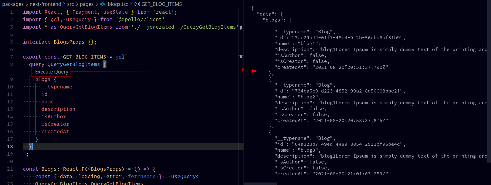

# NOTES

- [NOTES](#notes)
  - [Start Project based on Leo Roese Next+MUI5 Tutorial](#start-project-based-on-leo-roese-nextmui5-tutorial)
  - [Configure Apollo Client 3.0](#configure-apollo-client-30)
    - [Create Apollo Explorer Graph](#create-apollo-explorer-graph)
    - [Set up Apollo Client](#set-up-apollo-client)
    - [Add some gql to test codegen\](#add-some-gql-to-test-codegen)
    - [Configure Apollo CLi Scripts and Add dependencies](#configure-apollo-cli-scripts-and-add-dependencies)
    - [Test codegen](#test-codegen)
  - [Configure VSCode GraphQL Extension](#configure-vscode-graphql-extension)
  - [Configure ApolloClient](#configure-apolloclient)
  - [Apollo-client self signed certificate](#apollo-client-self-signed-certificate)
  - [Fix frontend : NET:ERR_CERT_AUTHORITY_INVALID](#fix-frontend--neterr_cert_authority_invalid)
  - [Fix : Response to preflight request doesn't pass access control check: The value of the 'Access-Control-Allow-Credentials' header in the response is '' which must be 'true' when the request's credentials mode is 'include'](#fix--response-to-preflight-request-doesnt-pass-access-control-check-the-value-of-the-access-control-allow-credentials-header-in-the-response-is--which-must-be-true-when-the-requests-credentials-mode-is-include)
  - [Authenticated GraphQL Requests In Next.js](#authenticated-graphql-requests-in-nextjs)

## Start Project based on Leo Roese Next+MUI5 Tutorial

KoakhLaptop:/home/mario/Development/React/@NextJsLeoRoeseMUIv5StarterTutorial

- [Next.js 11 setup with Material UI Version 5 | Part 1 - Emotion](https://www.youtube.com/watch?v=IFaFFmPYyMI)

- [Next.js 11 setup with Material UI Version 5 | Part 2 - Styled-Components](https://www.youtube.com/watch?v=NWQdxS1HOog)

- [GitHub - leoroese/nextjs-materialui-v5-tutorial at starter](https://github.com/leoroese/nextjs-materialui-v5-tutorial/tree/starter)

Default branch
  main
Active branches
  styled-components
  starter
  emotion

## Configure Apollo Client 3.0

- [Set up Apollo Client](https://www.apollographql.com/docs/tutorial/client/)
- [Schema registration via schema reporting](https://www.apollographql.com/docs/studio/schema/schema-reporting/)

follow `koakhlaptop:/home/mario/Development/Node/@Apollo/ApolloOficialFullStackTutorial/start/client`

### Create Apollo Explorer Graph

run server and go to <localhost:5000/graphql> and click apollo icon


next create a **new graph**


> must be a **Deployed graphs**, **API keys are not available for development graphs.**

There are two types of graphs in Studio:

- Deployed graphs are shared with other members of your organization. Create a deployed graph for every use case except local development.
- Development graphs (dev graphs for short) are only visible to you. Use them to help you iterate on your graph in your development environment.


now it creates 


### [Set up Apollo Client](https://www.apollographql.com/docs/tutorial/client/#install-the-apollo-extension-for-vscode-optional)

add `packages/next-frontend/.env`

```conf
HOST=localhost
BROWSER=none
APOLLO_KEY=service:GraphqlLibraryStarter:6gOBl8Q8Mxnq38feSOiPsA
APOLLO_GRAPH_ID=GraphqlLibraryStarter
APOLLO_GRAPH_VARIANT=current
APOLLO_SCHEMA_REPORTING=true
```

add `packages/next-frontend/apollo.config.js`

get `GraphqlLibraryStarter` from **Graph ID**

```json
module.exports = {
  client: {
    name: 'Space Explorer [web]',
    service: 'GraphqlLibraryStarter',
  },
};
```

### Add some gql to test codegen\

add `packages/next-frontend/src/pages/blogs.ts`

```typescript
import { gql, useQuery } from '@apollo/client'

// include client-side fields in any GraphQL query you write. add the @client directive
export const GET_BLOG_ITEMS = gql`
  query QueryGetBlogItems {
    blogs {
      __typename
      id
      name
      description
      isAuthor
      isCreator
      createdAt
    }
  }
`;
```

### Configure Apollo CLi Scripts and Add dependencies

add apollo cli script `package.json`

```json
{
  "scripts": {
    "next-frontend:codegen": "yarn workspace next-frontend run codegen"
  }
```

add apollo cli `packages/next-frontend/package.json`

```json
{
  "devDependencies": {
    "apollo": "^2.32.5"
  },
```

### Test codegen

```shell
$ yarn install
$ yarn run next-frontend:codegen
  ✔ Loading Apollo Project
  ✔ Generating query files with 'typescript' target - wrote 2 files
```

```typescript
generated type `packages/next-frontend/src/pages/__generated__/QueryGetBlogItems.ts`

export interface QueryGetBlogItems_blogs {
  __typename: "Blog";
  id: string;
  name: string;
  description: string;
  isAuthor: boolean | null;
  isCreator: boolean | null;
  createdAt: any | null;
}

export interface QueryGetBlogItems {
  blogs: QueryGetBlogItems_blogs[];
}
```

## Configure VSCode GraphQL Extension

- [Getting Started With Next.js and GraphQL Authentication](https://lyonwj.com/blog/grandstack-podcast-app-next-js-graphql-authentication)

add config

```yaml
schema: https://localhost:5001/graphql
# schema: 'schema.graphql'
documents: '**/*.{graphql,js,ts,jsx,tsx}'
rejectUnauthorized: true
extensions:
  endpoints:
    default:
      url: https://localhost:5001/graphql
      # headers: { Authorization: `Bearer ${process.env.API_TOKEN}` },
```

> schema.graphql must be exported from apollo explorer

seems that this only works with https endpoints, after configure server with graphql it start to work



to enable use pallete and **execute graphql operations**

to use self signed certificates add to `settings.json` `"vscode-graphql.rejectUnauthorized": false`

## Configure ApolloClient

- [Next.js With Apollo, SSR, Cookies, and Typescript](https://www.rockyourcode.com/nextjs-with-apollo-ssr-cookies-and-typescript/)
- [GitHub - borisowsky/next-advanced-apollo-starter: Advanced, but minimalistic Next.js pre-configured starter with focus on DX](https://github.com/borisowsky/next-advanced-apollo-starter)
- [nextjs-ecommerce/paginationField.ts at main · sophiabrandt/nextjs-ecommerce](https://github.com/sophiabrandt/nextjs-ecommerce/blob/main/frontend/lib/paginationField.ts)

`packages/next-frontend/src/lib/apolloClient.ts`

```shell
$ cd packages/next-frontend/
# deps
$ yarn add @apollo/client @apollo/link-error @apollo/react-common @apollo/react-hooks deepmerge lodash graphql graphql-upload isomorphic-unfetch apollo-upload-client
# types
$ yarn add -D @types/apollo-upload-client
```

## Apollo-client self signed certificate

- [Apollo-client self signed certificate - Pretag](https://pretagteam.com/question/apolloclient-self-signed-certificate)

add `agent`

```typescript
createUploadLink({
  uri: envVariables.graphqlApiUrl,
  // Make sure that CORS and cookies work
  fetchOptions: {
    mode: 'cors',
    agent: new https.Agent({
      rejectUnauthorized: false
    })
  },
  credentials: 'include',
  fetch: enhancedFetch,
}),
```

## Fix frontend : NET:ERR_CERT_AUTHORITY_INVALID

- [How do I deal with NET:ERR_CERT_AUTHORITY_INVALID in Chrome?](https://superuser.com/questions/1083766/how-do-i-deal-with-neterr-cert-authority-invalid-in-chrome)

go to <https://127.0.0.1:5001/> and **accept certificate**


after accept risk it start to work

## Fix : Response to preflight request doesn't pass access control check: The value of the 'Access-Control-Allow-Credentials' header in the response is '' which must be 'true' when the request's credentials mode is 'include'

- [Apollo Server Express - CORS issue · Issue #3760 · apollographql/apollo-server](https://github.com/apollographql/apollo-server/issues/3760)

fixed the issue by doing the following things :

- set cors origin as the client url and credential as true at server side `cors: { origin: CLIENT_URL, credentials: true }`
- and set credentials: `include` at client side

```shell
Access to fetch at 'https://localhost:5001/graphql' from origin 'http://localhost:3000' has been blocked by CORS policy: Response to preflight request doesn't pass access control check: The value of the 'Access-Control-Allow-Credentials' header in the response is '' which must be 'true' when the request's credentials mode is 'include'.
```

solution #1 : add `credentials: true` to server

```typescript
graphql.server.applyMiddleware({
  app,
  cors: {
    // add '*'
    origin: config.CORS_ORIGIN,
    methods: 'POST',
    credentials: true
    // preflightContinue: true,
  }
});
```

or solution #2 :comment `credentials: 'include'` on frontend
BUT use one or another not both, opeted to use server solution #1

```typescript
createUploadLink({
  ...
  // credentials: 'include',
}),
```


apollo explorer self signed certificate

npx diagnose-endpoint@1.0.12 --endpoint=https://localhost:5001/graphql | grep code
  code: 'DEPTH_ZERO_SELF_SIGNED_CERT',


add `https://studio.apollographql.com` to cors

`packages/neo4j-gqllib-starter/server/.env`

CORS_ORIGIN=http://localhost:3000,https://studio.apollographql.com


above link has authLink

## Authenticated GraphQL Requests In Next.js

- [Getting Started With Next.js and GraphQL Authentication](https://lyonwj.com/blog/grandstack-podcast-app-next-js-graphql-authentication)
- [grandcast.fm/auth.js at master · johnymontana/grandcast.fm](https://github.com/johnymontana/grandcast.fm/blob/master/next-app/lib/auth.js)

